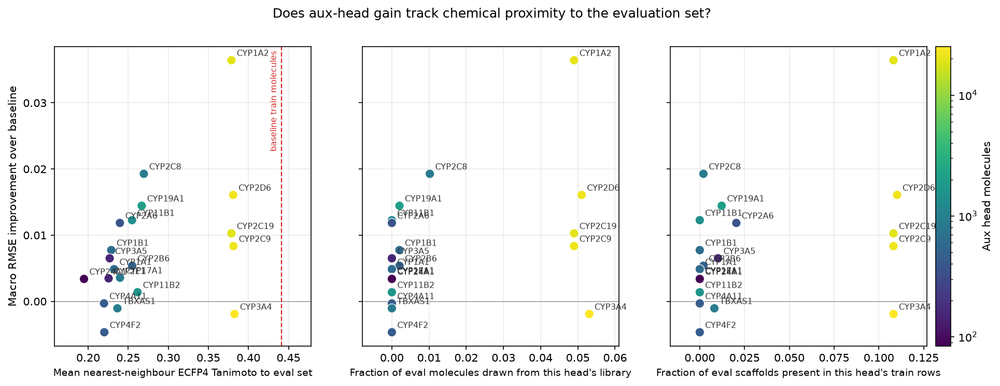

# Auxiliary Head Analysis: Which Isoforms Help the CYP Challenge

> **Updated 2026-09-22 with the fixed head-search run.** The original
> 2026-09-14 version of this report compared every configuration against a
> baseline whose loss went NaN at epoch 1 and that was scored from its
> epoch-0 checkpoint; it was retracted 2026-09-21. Root cause, proof and fix:
> `reports/head_search_baseline_bug.md`. Every number below is from the
> re-run with the fix (rows carrying no selected label are dropped before
> training). None of the original conclusions carry over — the "bimodal"
> split, the ~0.2 gains, and the CYP1A2+CYP2C8 pick were artefacts of which
> runs survived training, not of transfer.

Source data: `results/head_search.json` (greedy head-search, protein
granularity, 3 seeds x 30 epochs, BU SCC, 2026-09-22) and
`results/aux_similarity.csv` (molecule counts and chemical proximity to the
eval set, `scripts/aux_similarity.py`). RMSE is scored on the pinned split's
`test` rows (488 molecules).

## TL;DR

The no-aux baseline is **0.7557 ± 0.0036**, not 0.9430 — aux-head gains are
worth hundredths of RMSE, not tenths. The best configuration is **CYP1A2
alone (0.7193 ± 0.0065, gain +0.036)**; the greedy search stops after round 1
because no second head improves on it. 7 of 20 solo heads beat baseline by
more than 2 combined seed SDs (CYP1A2, CYP2C8, CYP2D6, CYP19A1, CYP11B1,
CYP2C9, CYP1B1); the rest are indistinguishable from noise. Row count still
does not predict gain (Spearman ρ = +0.33, p = 0.15) — an 888-molecule family
head (CYP2C8) is the second-best head, and the largest head (CYP3A4, 25,191
molecules) is net zero. Chemical proximity to the eval set does correlate,
weakly (ρ = +0.49, p = 0.027; family heads only, ρ = +0.60, p = 0.018).

## 1. Data volume by isoform

Molecule counts below are from the current union (`results/aux_similarity.csv`,
`n_molecules`): distinct molecules carrying at least one of that gene's
auxiliary labels. The per-source breakdown (challenge/qHTS/ChEMBL/BindingDB)
from the 2026-09-14 pull is not reproduced here — the union was rebuilt on
2026-09-21 and the per-source counts have not been regenerated against it.

| Gene | Tier | Molecules |
|---|---|---|
| CYP3A4 | qHTS | 25,191 |
| CYP2D6 | qHTS | 21,869 |
| CYP2C9 | qHTS | 21,572 |
| CYP1A2 | qHTS | 19,931 |
| CYP2C19 | qHTS | 19,596 |
| CYP19A1 | family | 2,058 |
| CYP11B2 | family | 1,659 |
| CYP11B1 | family | 1,393 |
| TBXAS1 | family | 907 |
| CYP2C8 | family | 888 |
| CYP17A1 | family | 856 |
| CYP1B1 | family | 636 |
| CYP1A1 | family | 608 |
| CYP2B6 | family | 498 |
| CYP4F2 | family | 442 |
| CYP4A11 | family | 440 |
| CYP2A6 | family | 382 |
| CYP3A5 | family | 155 |
| CYP2E1 | family | 151 |
| CYP24A1 | family | 84 |

Two clean tiers by volume: five "qHTS" isoforms (CYP1A2/2C9/2C19/2D6/3A4,
~20k-25k molecules each, all sharing the AID 1851 screening panel) vs. fifteen
"family-only" isoforms (84-2,058 molecules, ChEMBL/BindingDB literature
curation only) — roughly a 10-250x gap in scale between the two tiers.

## 2. Single-head performance vs. volume

*Generated by `scripts/plot_volume_vs_gain.py`.*

Solo-aux macro RMSE from the fixed 2026-09-22 run (baseline, no aux:
**0.7557 ± 0.0036**), sorted by solo macro RMSE. Molecules = union molecules
carrying at least one of the head's labels (`results/aux_similarity.csv`).
Gain = baseline − solo, bold where it exceeds 2 combined seed SDs. The four
Δ columns are the per-task RMSE change (positive = better).

| Head | Tier | Molecules | Solo macro RMSE | Gain | Gain / combined SD | Δ CYP1A2 task | Δ CYP2C9 task | Δ CYP2D6 task | Δ CYP3A4 task |
|---|---|---|---|---|---|---|---|---|---|
| CYP1A2 | qHTS, self-aux | 19,931 | 0.7193 ± 0.0065 | **+0.0364** | 4.9 | +0.021 | +0.058 | +0.001 | +0.066 |
| CYP2C8 | family | 888 | 0.7365 ± 0.0025 | **+0.0193** | 4.4 | +0.011 | +0.019 | +0.011 | +0.036 |
| CYP2D6 | qHTS, self-aux | 21,869 | 0.7397 ± 0.0021 | **+0.0161** | 3.9 | +0.009 | +0.007 | +0.007 | +0.042 |
| CYP19A1 | family | 2,058 | 0.7413 ± 0.0039 | **+0.0144** | 2.7 | +0.001 | +0.005 | +0.003 | +0.048 |
| CYP11B1 | family | 1,393 | 0.7435 ± 0.0026 | **+0.0123** | 2.8 | +0.010 | -0.003 | +0.014 | +0.028 |
| CYP2A6 | family | 382 | 0.7439 ± 0.0059 | +0.0118 | 1.7 | -0.002 | +0.008 | +0.020 | +0.021 |
| CYP2C19 | qHTS | 19,596 | 0.7455 ± 0.0064 | +0.0103 | 1.4 | +0.012 | -0.015 | +0.007 | +0.037 |
| CYP2C9 | qHTS, self-aux | 21,572 | 0.7474 ± 0.0017 | **+0.0084** | 2.1 | -0.004 | +0.028 | -0.002 | +0.011 |
| CYP1B1 | family | 636 | 0.7480 ± 0.0014 | **+0.0077** | 2.0 | +0.006 | +0.003 | +0.002 | +0.019 |
| CYP3A5 | family | 155 | 0.7492 ± 0.0038 | +0.0065 | 1.3 | +0.001 | +0.001 | +0.004 | +0.020 |
| CYP2B6 | family | 498 | 0.7504 ± 0.0004 | +0.0054 | 1.5 | -0.003 | +0.004 | +0.010 | +0.012 |
| CYP1A1 | family | 608 | 0.7509 ± 0.0015 | +0.0049 | 1.3 | +0.005 | -0.011 | +0.003 | +0.022 |
| CYP17A1 | family | 856 | 0.7522 ± 0.0013 | +0.0036 | 0.9 | -0.007 | -0.000 | +0.008 | +0.014 |
| CYP2E1 | family | 151 | 0.7523 ± 0.0032 | +0.0035 | 0.7 | -0.007 | +0.006 | +0.002 | +0.014 |
| CYP24A1 | family | 84 | 0.7524 ± 0.0079 | +0.0034 | 0.4 | +0.001 | -0.002 | +0.004 | +0.011 |
| CYP11B2 | family | 1,659 | 0.7544 ± 0.0020 | +0.0014 | 0.3 | -0.015 | +0.006 | +0.003 | +0.011 |
| CYP4A11 | family | 440 | 0.7561 ± 0.0042 | -0.0003 | -0.1 | -0.003 | -0.010 | +0.010 | +0.002 |
| TBXAS1 | family | 907 | 0.7568 ± 0.0014 | -0.0011 | -0.3 | -0.014 | +0.001 | -0.004 | +0.014 |
| CYP3A4 | qHTS, self-aux | 25,191 | 0.7576 ± 0.0033 | -0.0019 | -0.4 | -0.027 | -0.034 | +0.003 | +0.050 |
| CYP4F2 | family | 442 | 0.7604 ± 0.0073 | -0.0047 | -0.6 | -0.005 | -0.005 | +0.000 | -0.009 |

"self-aux" in the Tier column means this gene's aux columns train the *same* isoform
that also has a scored/evaluated column (`{gene}_pIC50_direct_inhibition`).
Only 4 of the 20 candidates qualify: CYP1A2, CYP2C9, CYP2D6, CYP3A4. All
other candidates, including the qHTS-tier CYP2C19, have no scored column at
all — their only route to the eval metric is generic shared-encoder transfer.
See Section 3 for why this distinction matters for reading the qHTS-tier
ranking.

Two observations that argue against a simple "more data = better" story:

1. **Within the qHTS tier, volume and rank are inversely related.** CYP3A4
   has the most molecules (25,191) but is net zero (0.7576, gain -0.002).
   CYP1A2 has the fewest of the five qHTS heads (19,931) and is the best head
   overall (0.7193, gain +0.036). If raw volume drove the gain, CYP3A4 should
   have won.
2. **Within the family-only tier, molecule count does not separate the
   heads that clear noise from the ones that don't.** CYP2C8 (888 molecules)
   is the second-best head overall (+0.019); TBXAS1 (907, essentially the
   same count) is indistinguishable from baseline (-0.001). CYP24A1 (84) and
   CYP19A1 (2,058) — a 24x gap — land at similar gains (+0.003 and +0.014).

## 3. Self-aux: CYP1A2/CYP2C9/CYP2D6/CYP3A4 have a "home task" channel the others don't — but it doesn't reliably help

chemprop's architecture is one shared MPNN encoder with a **separate output
FFN head per target column** — `CYP3A4_pIC50_direct_inhibition` (scored) and
`CYP3A4_pIC50_aid1851`/`pIC50_chembl`/`pIC50_bindingdb` (aux) do not share
parameters directly, only through the encoder. And `build-union` already
drops any aux row whose SMILES overlaps `test.csv`, so this is not label
leakage. It is a real, distinct mechanism from generic transfer — but in the
fixed run it does not reliably inflate the four self-aux candidates relative
to the others: CYP1A2 and CYP2D6 do best partly through it, CYP3A4 does not
benefit from it at all (below), and CYP2C9's gain is almost entirely confined
to its own task rather than spread by it.

Evidence — compare the four task RMSEs under two different solo-aux configs,
from `results/head_search.json`:

| Config | CYP1A2 task | CYP2C9 task | CYP2D6 task | **CYP3A4 task** | Macro RMSE |
|---|---|---|---|---|---|
| baseline (no aux) | 0.8994 | 0.5876 | 0.7924 | 0.7435 | 0.7557 |
| aux = CYP1A2 (different isoform) | 0.8786 | 0.5298 | 0.7916 | **0.6772** | 0.7193 |
| aux = CYP3A4 (self) | 0.9262 | 0.6216 | 0.7889 | **0.6940** | 0.7576 |

CYP3A4-aux does move its own task (0.7435 -> 0.6940), but *less* than
CYP1A2-aux moves it (0.7435 -> 0.6772) despite CYP1A2-aux carrying no CYP3A4
label at all. And CYP3A4-aux actively hurts the other two tasks it touches:
CYP1A2 task rises from baseline (0.8994 -> 0.9262) and CYP2C9 task rises
(0.5876 -> 0.6216), while CYP1A2-aux drops both. That combination — a weaker
own-task effect and a negative effect on two of the other three — is why
CYP3A4-aux nets essentially zero (0.7576, gain -0.002) despite having the
most molecules of any candidate (25,191, Section 1).

Reading: a self-aux head is not automatically informative about "does this
aux head generalize" — CYP3A4-aux is the clearest counterexample, a
self-scored head that does not lift the other three tasks. Of the other three
self-aux heads that beat noise, CYP1A2-aux and CYP2D6-aux lift most of the
other tasks too (Section 2's Δ columns); CYP2C9-aux mainly lifts its own task
and barely moves the rest. So the self/external split is not predictive by
itself the way it looked in the broken run — it needs to be read per head.

## 4. What might actually be driving the ranking

Row count is not the answer (Section 1-2). Four other candidate explanations,
now tested against the fixed-run gains.

### 4a. Chemical-space overlap with the eval set

`scripts/aux_similarity.py` measures, per head, how close its training
molecules sit to the 488 held-out test molecules the RMSE is scored on, four
ways:

| Measure | What it captures | ρ vs. gain (n=20) | ρ, family only (n=15) |
|---|---|---|---|
| `nn_tanimoto_mean` | mean nearest-neighbour ECFP4 Tanimoto, this head's train molecules to the eval set | +0.49 (p=0.027) | +0.60 (p=0.018) |
| `scaffold_overlap_frac` | fraction of eval molecules whose Bemis-Murcko scaffold appears in this head's train rows | +0.47 (p=0.035) | — |
| `eval_in_aux_frac` | fraction of eval molecules that also carry this head's label (composition, not leakage — they're held out together) | +0.46 (p=0.042) | — |
| `nn_tanimoto_matched_mean` | `nn_tanimoto_mean` on a 500-molecule random subsample, so proximity is read independently of head size | +0.47 (p=0.108) | — |

All four point the same weak-positive direction. The matched control is the
one that isolates proximity from volume, and its correlation is the same
size (+0.47) but loses significance (p=0.108) — expected, since it only has
13 of 20 heads to work with: `nn_tanimoto_matched_mean` requires ≥500 training
molecules per head, so the 7 smallest family heads (CYP3A5, CYP2E1, CYP2B6,
CYP2A6, CYP24A1, CYP4A11, CYP4F2 — all under 500) are `nan` and dropped.
Those are also 6 of the 7 heads with a gain within noise, so the missing
values are concentrated exactly where "no effect" is already the reading.

*Generated by `scripts/plot_similarity_vs_gain.py`. The dashed red line in
the left panel is `__train_scored__` (0.441 mean Tanimoto) — how close the
baseline model's own training molecules already sat to the eval set, before
any aux head is added. Every aux head sits to the left of it: every one of
them is chemically *further* from the eval set than what the model already
had. `__train_all__` (0.470) is the ceiling — every molecule in the union,
aux or not.*

Reading: weak but real, and consistent across four independently-computed
measures instead of one. None of the four explains the full ranking on its
own — CYP3A4 is closer to the eval set than CYP1A2 on every measure and
still nets zero (Section 5) — but a head's gain is not independent of how
close its molecules sit to the eval set, and this is the closest thing to a
positive result Sections 4-5 have.

### 4b. Protein relatedness between the aux isoform and the scored four

Tested — see `reports/protein_similarity_analysis.md`. No axis reaches
significance (whole-protein identity ρ = +0.30, fold TM-score ρ = +0.34,
pocket identity ρ = +0.32, pocket RMSD ρ = -0.34; all p = 0.14-0.20 over 20
heads). CYP3A5 shares 90% of CYP3A4's active-site residues and is within
noise (+0.007); CYP19A1 and CYP11B1, both under 25% identity to any scored
isoform, both beat noise (+0.014, +0.012). Weaker than the chemical-proximity
result in 4a on every axis, despite testing the same underlying idea
(relatedness -> transfer) from the protein side instead of the ligand side.

### 4c. Label quality/consistency

Not tested. ChEMBL/BindingDB pulls are heterogeneous across labs and assay
protocols per target; some targets in the family set may have more
internally consistent IC50 measurements than others, independent of count.

### 4d. Redundancy inside the qHTS tier

CYP1A2+CYP2C19 (0.7356) is worse than CYP1A2 alone (0.7193) — adding a second
qHTS head makes the macro RMSE worse, not better. All 5 qHTS isoforms were
screened against the *same* compound library in one assay, so CYP2C19's
block of examples likely restates chemistry the encoder already saw from
CYP1A2's block rather than adding new coverage. Consistent with why greedy
never adds a second qHTS head (Section 5).

## 5. What the greedy search actually picked

- **Round 1** picked CYP1A2 — the largest solo gain of any of the 20
  candidates (+0.036). Note this is *not* the head closest to the eval set by
  nearest-neighbour Tanimoto (CYP3A4 is, at 0.383 vs. CYP1A2's 0.379,
  `results/aux_similarity.csv`) — proximity correlates with gain across heads
  (Section 4) but does not simply rank them.
- **Round 2 found nothing.** All 19 pairs built on CYP1A2 score between
  0.7241 (CYP1A2+CYP2C8, the best pair) and 0.7356 — every one of them worse
  than CYP1A2 alone (0.7193). The search stops here.
- This differs from the 2026-09-14 run's pick of CYP1A2+CYP2C8 as a genuine
  round-2 improvement. In the fixed run CYP2C8 solo is real (+0.019, the
  second-best head), and the pair (0.7241) does beat CYP2C8 alone (0.7365) —
  but it is worse than CYP1A2 alone (0.7193). The two heads are not additive:
  combining them loses ground relative to just using the better one. Whether
  the two heads' molecules are chemically overlapping enough to compete for
  the same encoder capacity, or the search is simply picking up seed noise at
  the margin, is not distinguished by this data.

## 6. Practical takeaways

- **Don't rank candidate aux heads by row count.** CYP3A4's 25,191 molecules
  did not outperform CYP1A2's 19,931; TBXAS1's 907 did not outperform
  CYP2C8's 888. Row count is not a ranking signal at this scale.
- **The qHTS tier does not stack.** CYP1A2+CYP2C19 (0.7356) is worse than
  CYP1A2 alone (0.7193), and greedy's round 2 found no improving pair at all
  — treat the five qHTS aux blocks as largely redundant with each other.
- **Enzyme similarity is not the lever.** No axis reaches significance,
  including heme-pocket sequence and shape
  (`reports/protein_similarity_analysis.md`). The encoder never sees the
  protein, so a head's value is a property of its molecules.
- **Chemical proximity to the eval set is the best predictor found so far**
  (ρ = +0.49 overall, +0.60 family-only), but it is weak and does not fully
  separate the heads that clear noise from the ones that don't — it is a
  lead for a follow-up, not a ranking rule to apply directly.
- **The current best usable configuration is CYP1A2 alone**, not a pair. Any
  downstream use of this search should start there rather than from the
  retracted CYP1A2+CYP2C8 pick.

## Appendix: every config evaluated

All 40 configurations the greedy search touched (baseline, 20 solo heads, 19
pairs built on the round-1 pick), with per-task RMSE on the four scored
heads. Sorted by macro RMSE, best first. Source: `results/head_search.json`.

| Config | Macro RMSE | SD | CYP1A2 | CYP2C9 | CYP2D6 | CYP3A4 |
|---|---|---|---|---|---|---|
| CYP1A2 | 0.7193 | 0.0065 | 0.8786 | 0.5298 | 0.7916 | 0.6772 |
| CYP1A2+CYP2C8 | 0.7241 | 0.0044 | 0.8756 | 0.5288 | 0.7875 | 0.7046 |
| CYP1A2+CYP17A1 | 0.7250 | 0.0006 | 0.8837 | 0.5358 | 0.7871 | 0.6935 |
| CYP1A2+CYP1B1 | 0.7259 | 0.0045 | 0.8907 | 0.5400 | 0.7923 | 0.6807 |
| CYP1A2+CYP3A5 | 0.7267 | 0.0026 | 0.8868 | 0.5478 | 0.7896 | 0.6827 |
| CYP1A2+CYP4A11 | 0.7276 | 0.0063 | 0.8911 | 0.5432 | 0.7814 | 0.6946 |
| CYP1A2+CYP24A1 | 0.7284 | 0.0046 | 0.8907 | 0.5473 | 0.7877 | 0.6879 |
| CYP1A2+CYP2C9 | 0.7284 | 0.0031 | 0.8887 | 0.5094 | 0.7998 | 0.7157 |
| CYP1A2+CYP11B1 | 0.7287 | 0.0082 | 0.8927 | 0.5414 | 0.7896 | 0.6910 |
| CYP1A2+CYP1A1 | 0.7290 | 0.0065 | 0.8814 | 0.5421 | 0.7857 | 0.7068 |
| CYP1A2+CYP2B6 | 0.7297 | 0.0049 | 0.8869 | 0.5456 | 0.7922 | 0.6939 |
| CYP1A2+CYP11B2 | 0.7311 | 0.0058 | 0.8891 | 0.5423 | 0.7964 | 0.6967 |
| CYP1A2+CYP2A6 | 0.7312 | 0.0044 | 0.9021 | 0.5351 | 0.7855 | 0.7022 |
| CYP1A2+CYP3A4 | 0.7315 | 0.0018 | 0.8908 | 0.5830 | 0.7896 | 0.6628 |
| CYP1A2+TBXAS1 | 0.7319 | 0.0050 | 0.8922 | 0.5586 | 0.7854 | 0.6913 |
| CYP1A2+CYP4F2 | 0.7330 | 0.0037 | 0.8958 | 0.5518 | 0.7905 | 0.6937 |
| CYP1A2+CYP19A1 | 0.7346 | 0.0062 | 0.9102 | 0.5342 | 0.7914 | 0.7025 |
| CYP1A2+CYP2E1 | 0.7348 | 0.0053 | 0.8888 | 0.5441 | 0.7976 | 0.7086 |
| CYP1A2+CYP2C19 | 0.7356 | 0.0031 | 0.8737 | 0.5706 | 0.7995 | 0.6988 |
| CYP2C8 | 0.7365 | 0.0025 | 0.8883 | 0.5688 | 0.7817 | 0.7070 |
| CYP2D6 | 0.7397 | 0.0021 | 0.8906 | 0.5809 | 0.7855 | 0.7017 |
| CYP19A1 | 0.7413 | 0.0039 | 0.8987 | 0.5822 | 0.7889 | 0.6954 |
| CYP11B1 | 0.7435 | 0.0026 | 0.8894 | 0.5909 | 0.7782 | 0.7154 |
| CYP1A2+CYP2D6 | 0.7435 | 0.0061 | 0.9179 | 0.5696 | 0.7757 | 0.7109 |
| CYP2A6 | 0.7439 | 0.0059 | 0.9010 | 0.5792 | 0.7729 | 0.7225 |
| CYP2C19 | 0.7455 | 0.0064 | 0.8877 | 0.6027 | 0.7853 | 0.7062 |
| CYP2C9 | 0.7474 | 0.0017 | 0.9033 | 0.5592 | 0.7944 | 0.7326 |
| CYP1B1 | 0.7480 | 0.0014 | 0.8931 | 0.5842 | 0.7905 | 0.7241 |
| CYP3A5 | 0.7492 | 0.0038 | 0.8987 | 0.5862 | 0.7886 | 0.7235 |
| CYP2B6 | 0.7504 | 0.0004 | 0.9027 | 0.5841 | 0.7827 | 0.7319 |
| CYP1A1 | 0.7509 | 0.0015 | 0.8947 | 0.5984 | 0.7893 | 0.7211 |
| CYP17A1 | 0.7522 | 0.0013 | 0.9067 | 0.5880 | 0.7842 | 0.7298 |
| CYP2E1 | 0.7523 | 0.0032 | 0.9066 | 0.5821 | 0.7904 | 0.7299 |
| CYP24A1 | 0.7524 | 0.0079 | 0.8987 | 0.5900 | 0.7884 | 0.7323 |
| CYP11B2 | 0.7544 | 0.0020 | 0.9145 | 0.5814 | 0.7893 | 0.7323 |
| baseline | 0.7557 | 0.0036 | 0.8994 | 0.5876 | 0.7924 | 0.7435 |
| CYP4A11 | 0.7561 | 0.0042 | 0.9027 | 0.5979 | 0.7823 | 0.7413 |
| TBXAS1 | 0.7568 | 0.0014 | 0.9139 | 0.5869 | 0.7967 | 0.7297 |
| CYP3A4 | 0.7576 | 0.0033 | 0.9262 | 0.6216 | 0.7889 | 0.6940 |
| CYP4F2 | 0.7604 | 0.0073 | 0.9045 | 0.5923 | 0.7923 | 0.7526 |

Best solo head (CYP1A2) beats baseline by 0.0364 macro RMSE — 4.9x the
combined seed SD of the two runs, a real effect. No pair beats it; the best
pair (CYP1A2+CYP2C8, 0.7241) is 0.0048 worse than CYP1A2 alone.
