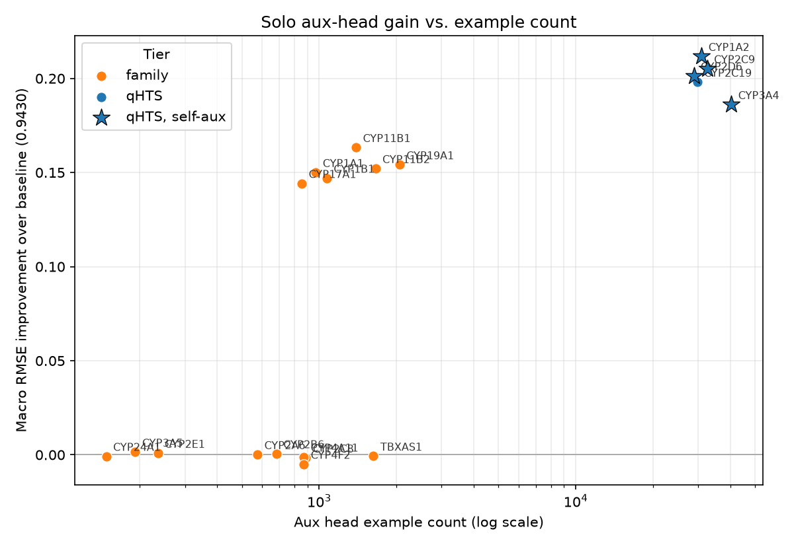

# Auxiliary Head Analysis: Which Isoforms Help the CYP Challenge

Source data: `results/data_counts.csv` (example counts per isoform/source) and
`results/head_search_results.csv` (greedy head-search macro RMSE per config),
from the BU SCC run on 2026-09-14.

## TL;DR

Data volume alone does **not** predict which aux head helps. The pattern is
closer to bimodal: a head either produces a large gain (macro RMSE ~0.72-0.80)
or produces almost none (~0.94, indistinguishable from baseline 0.9430), with
few configs in between. Within the large-gain group, more rows is not better
— the single most-data-rich head (CYP3A4, 40,432 rows) is the *worst*
performer of that group. Row count explains which heads are candidates, not
which ones win.

## 1. Data volume by isoform

| Gene | Challenge | qHTS pIC50 | qHTS pctinhib | ChEMBL | BindingDB | Total |
|---|---|---|---|---|---|---|
| CYP3A4 | 2335 | 8507 | 16141 | 5248 | 8201 | 40432 |
| CYP2C9 | 1285 | 7199 | 16141 | 2782 | 5120 | 32527 |
| CYP1A2 | 1412 | 9552 | 16141 | - | 3853 | 30958 |
| CYP2C19 | - | 8845 | 16141 | 1562 | 3232 | 29780 |
| CYP2D6 | 1493 | 5402 | 16141 | - | 5811 | 28847 |
| CYP19A1 | - | - | - | - | 2058 | 2058 |
| TBXAS1 | - | - | - | 805 | 823 | 1628 |
| CYP11B2 | - | - | - | - | 1659 | 1659 |
| CYP1B1 | - | - | - | 590 | 481 | 1071 |
| CYP1A1 | - | - | - | 519 | 452 | 971 |
| CYP2C8 | - | - | - | - | 888 | 888 |
| CYP4A11 | - | - | - | 432 | 440 | 872 |
| CYP4F2 | - | - | - | 430 | 442 | 872 |
| CYP11B1 | - | - | - | - | 1393 | 1393 |
| CYP17A1 | - | - | - | - | 856 | 856 |
| CYP2B6 | - | - | - | 204 | 478 | 682 |
| CYP2A6 | - | - | - | 212 | 363 | 575 |
| CYP2E1 | - | - | - | 92 | 143 | 235 |
| CYP3A5 | - | - | - | 40 | 152 | 192 |
| CYP24A1 | - | - | - | 70 | 78 | 148 |

Two clean tiers by volume: five "qHTS" isoforms (CYP1A2/2C9/2C19/2D6/3A4,
~29k-40k rows each, all sharing the AID 1851 screening panel) vs. fifteen
"family-only" isoforms (148-2058 rows, ChEMBL/BindingDB literature curation
only) — roughly a 20-100x gap in scale between the two tiers.

## 2. Single-head performance vs. volume

*Generated by `scripts/plot_volume_vs_gain.py`.*

Solo-aux macro RMSE (baseline, no aux: **0.9430 ± 0.0018**), sorted by total
row count:

| Gene | Total rows | Solo macro RMSE | Gain over baseline | Scored task? |
|---|---|---|---|---|
| CYP3A4 | 40432 | 0.7569 | 0.186 | **Yes (self-aux)** |
| CYP2C9 | 32527 | 0.7378 | 0.205 | **Yes (self-aux)** |
| CYP1A2 | 30958 | **0.7313** | **0.212 (best)** | **Yes (self-aux)** |
| CYP2C19 | 29780 | 0.7450 | 0.198 | No |
| CYP2D6 | 28847 | 0.7416 | 0.201 | **Yes (self-aux)** |
| CYP19A1 | 2058 | 0.7889 | 0.154 | No |
| TBXAS1 | 1628 | 0.9437 | -0.001 | No |
| CYP11B2 | 1659 | 0.7909 | 0.152 | No |
| CYP1B1 | 1071 | 0.7960 | 0.147 | No |
| CYP1A1 | 971 | 0.7930 | 0.150 | No |
| CYP2C8 | 888 | 0.9447 | -0.002 | No |
| CYP4A11 | 872 | 0.9442 | -0.001 | No |
| CYP4F2 | 872 | 0.9480 | -0.005 | No |
| CYP11B1 | 1393 | 0.7797 | 0.163 | No |
| CYP17A1 | 856 | 0.7988 | 0.144 | No |
| CYP2B6 | 682 | 0.9424 | 0.001 | No |
| CYP2A6 | 575 | 0.9429 | 0.000 | No |
| CYP2E1 | 235 | 0.9422 | 0.001 | No |
| CYP3A5 | 192 | 0.9416 | 0.001 | No |
| CYP24A1 | 148 | 0.9438 | 0.000 | No |

"Scored task?" = Yes means this gene's aux columns train the *same* isoform
that also has a scored/evaluated column (`{gene}_pIC50_direct_inhibition`).
Only 4 of the 20 candidates qualify: CYP1A2, CYP2C9, CYP2D6, CYP3A4. All
other candidates, including the qHTS-tier CYP2C19, have no scored column at
all — their only route to the eval metric is generic shared-encoder transfer.
See Section 3 for why this distinction matters for reading the qHTS-tier
ranking.

Two observations that argue against a simple "more data = better" story:

1. **Within the qHTS tier, volume and rank are inversely related at the top.**
   CYP3A4 has the most rows (40,432) but the *worst* macro RMSE of the five
   qHTS heads (0.7569). CYP1A2 has the fewest rows of the five (30,958) but
   the best (0.7313). If raw volume drove the gain, CYP3A4 should have won.
2. **Within the family-only tier, the split is bimodal, not gradual.**
   CYP19A1/CYP11B1/CYP11B2/CYP1B1/CYP1A1/CYP17A1 (856-2058 rows) all land in
   a real-improvement band (0.78-0.80). TBXAS1 (1628 rows — more than
   CYP11B1's 1393) sits at baseline (0.9437, statistically indistinguishable
   from 0.9430). CYP2C8, CYP4A11, CYP4F2 (similar row counts, 850-890) also
   sit at baseline. Row count does not separate the two groups; something
   about *which* isoforms cluster on which side does.

## 3. Self-aux confound: CYP1A2/CYP2C9/CYP2D6/CYP3A4 get a "home task" bonus the others can't

chemprop's architecture is one shared MPNN encoder with a **separate output
FFN head per target column** — `CYP3A4_pIC50_direct_inhibition` (scored) and
`CYP3A4_pIC50_aid1851`/`pIC50_chembl`/`pIC50_bindingdb` (aux) do not share
parameters directly, only through the encoder. And `build-union` already
drops any aux row whose SMILES overlaps `test.csv`, so this is not label
leakage. But it is a real, distinct mechanism from generic transfer, and it
specifically inflates the four self-aux candidates (CYP1A2, CYP2C9, CYP2D6,
CYP3A4) relative to every isoform with no scored column.

Evidence — compare the CYP3A4 task's own RMSE under two different solo-aux
configs, from `head_search_results.csv`:

| Config | CYP1A2 task | CYP2C9 task | CYP2D6 task | **CYP3A4 task** | Macro RMSE |
|---|---|---|---|---|---|
| aux = CYP1A2 (different isoform) | 0.9089 | 0.5300 | 0.7902 | **0.6959** | 0.7313 |
| aux = CYP3A4 (self) | 0.9327 | 0.6082 | 0.7913 | **0.6953** | 0.7569 |

CYP3A4's own task RMSE is nearly identical either way (0.6953 vs. 0.6959) —
adding CYP3A4's own aux data barely helps CYP3A4's own prediction any more
than a completely different isoform's aux data does. What CYP3A4-aux fails
to do is lift the *other three* tasks: CYP1A2 task stays near baseline (0.93
vs. baseline's 1.07) instead of dropping to 0.91 the way CYP1A2-aux does, and
CYP2C9 task lands at 0.61 instead of 0.53. That gap is why CYP3A4-aux is the
**worst** of the five qHTS heads on macro RMSE (0.7569) despite having the
most rows (40,432, Section 1).

Reading: CYP3A4-aux's apparent benefit is mostly a self-contained,
single-task effect (same isoform, different assay, teaches that one output
head's feature needs) rather than the broad shared-encoder improvement that
CYP1A2-aux, CYP2C9-aux, and CYP2D6-aux each produce across all four scored
tasks. When judging "does this aux head generalize," the three genuinely
self-scored heads that *do* still lift all four tasks (CYP1A2, CYP2C9,
CYP2D6) are more informative than CYP3A4's case, and both self-aux and
external-aux gains should be read separately rather than pooled into one
volume-vs-gain trend — a self-aux candidate had a supervision channel
(scored + own aux, same isoform) that no external candidate had access to.

## 4. What might actually be driving the split

Volume is a necessary enabler (every head below ~150 rows is flat, unsurprising —
too little signal to move a shared encoder) but not sufficient. Candidate
explanations for the bimodal pattern, not yet tested against the data:

- **Chemical-space overlap with the challenge set.** A family aux head that
  happens to share more scaffolds/analogs with the actual challenge molecules
  would regularize the encoder in a directly useful direction; one that's
  chemically disjoint (different scaffold space entirely) contributes little
  regardless of row count. This is testable: Tanimoto similarity between each
  aux head's molecule set and the challenge train/test molecules.
- **Protein relatedness between the aux isoform and the scored four.**
  Tested and **ruled out** — see `reports/protein_similarity_analysis.md`.
  Neither whole-protein identity, fold similarity, nor heme-pocket similarity
  predicts gain (rho = -0.00, +0.03, +0.13 over 20 heads); CYP3A5 shares 90%
  of CYP3A4's active-site residues and is inert, while CYP11B1 at 39% is the
  best family head.
- **Label quality/consistency.** ChEMBL/BindingDB pulls are heterogeneous
  across labs and assay protocols per target; some targets in the family set
  may have more internally consistent IC50 measurements than others,
  independent of count.
- **Redundancy inside the qHTS tier.** CYP2C19 (29,780 rows, almost the same
  scale as CYP1A2) is the one qHTS isoform whose combination with CYP1A2 is
  *worse* than CYP1A2 alone (0.7399 vs. 0.7313, see head_search_results.csv).
  All 5 qHTS isoforms were screened against the *same* compound library in
  one assay — CYP2C19's block of examples largely restates chemistry the
  encoder already saw from CYP1A2's block, rather than adding new coverage.
  This explains why the qHTS tier doesn't stack additively: it's five views
  of mostly the same molecule set, not five independent data sources.

## 5. What the greedy search actually picked, and why it's consistent with this

- **Round 1** picked CYP1A2 (largest gain among *distinct* aux blocks, not
  largest row count).
- **Round 2** picked CYP2C8 — solo useless (0.9447, baseline-level) but
  additive on top of CYP1A2 (0.7313 -> 0.7184). Consistent with the
  "independent chemistry, small volume" story: CYP2C8's ~888 rows are a
  small, unrelated chemical set (BindingDB only, no qHTS overlap), so once
  CYP1A2 has already done the heavy regularization, CYP2C8 adds a distinct
  sliver of chemistry rather than a redundant one.
- **Round 3** found nothing: every remaining candidate's marginal gain fell
  inside seed noise. Two plausible readings, not distinguished by this data:
  the shared encoder is saturated after 2 aux blocks, or every remaining
  candidate is redundant with what's already in (qHTS heads redundant with
  CYP1A2; several family heads chemically overlapping with CYP2C8/CYP1A2's
  contribution, or with each other).

## 6. Practical takeaways

- **Don't rank candidate aux heads by row count.** CYP3A4's 40k rows did not
  outperform CYP1A2's 31k; TBXAS1's 1628 rows did not outperform CYP11B1's
  1393. Row count is a floor (below ~150-200 rows a head is inert here), not
  a ranking signal above that floor.
- **The qHTS tier is not 5 independent datasets for search purposes.** Treat
  CYP1A2/2C9/2C19/2D6/3A4 aux blocks as largely overlapping; expect
  diminishing or negative returns from combining more than one or two, which
  is exactly what greedy found.
- **Enzyme similarity is not the lever.** Ruled out on four axes, including
  heme-pocket sequence and shape (`reports/protein_similarity_analysis.md`).
  The encoder never sees the protein, so a head's value is a property of its
  molecules.
- **Open question worth a follow-up run:** compute Tanimoto similarity
  between each aux head's molecules and the challenge molecule set, and
  re-plot solo-head gain against that instead of row count. That would
  directly test the "chemical overlap, not volume" hypothesis raised in
  Section 3.

## Appendix: every config evaluated

All 55 configurations the greedy search touched, with per-task RMSE on the
four scored heads. Sorted by macro RMSE, best first. Source:
`results/head_search_results.csv`.

| Config | Macro RMSE | SD | CYP1A2 | CYP2C9 | CYP2D6 | CYP3A4 |
|---|---|---|---|---|---|---|
| CYP1A2+CYP2C8 | 0.7184 | 0.0038 | 0.8859 | 0.5072 | 0.7899 | 0.6905 |
| CYP1A2+CYP1A1 | 0.7185 | 0.0024 | 0.8734 | 0.5292 | 0.7822 | 0.6891 |
| CYP1A2+CYP2C8+CYP1B1 | 0.7199 | 0.0114 | 0.8845 | 0.5020 | 0.8032 | 0.6899 |
| CYP1A2+CYP2C8+CYP1A1 | 0.7213 | 0.0076 | 0.8932 | 0.5055 | 0.7961 | 0.6903 |
| CYP1A2+CYP2C8+CYP2A6 | 0.7218 | 0.0048 | 0.9018 | 0.5055 | 0.7855 | 0.6944 |
| CYP1A2+CYP4F2 | 0.7221 | 0.0070 | 0.8854 | 0.5248 | 0.7870 | 0.6912 |
| CYP1A2+CYP3A5 | 0.7223 | 0.0064 | 0.8964 | 0.5196 | 0.7913 | 0.6818 |
| CYP1A2+CYP19A1 | 0.7223 | 0.0074 | 0.9015 | 0.5165 | 0.7817 | 0.6894 |
| CYP1A2+CYP2B6 | 0.7223 | 0.0051 | 0.8785 | 0.5322 | 0.7927 | 0.6858 |
| CYP1A2+CYP24A1 | 0.7226 | 0.0078 | 0.8901 | 0.5177 | 0.7902 | 0.6925 |
| CYP1A2+CYP2E1 | 0.7232 | 0.0051 | 0.8961 | 0.5197 | 0.7816 | 0.6952 |
| CYP1A2+CYP2C8+CYP2E1 | 0.7237 | 0.0028 | 0.8996 | 0.5083 | 0.7869 | 0.7000 |
| CYP1A2+CYP2C8+CYP4A11 | 0.7239 | 0.0047 | 0.9036 | 0.5134 | 0.7896 | 0.6889 |
| CYP1A2+CYP2C9 | 0.7245 | 0.0045 | 0.8698 | 0.5277 | 0.7964 | 0.7039 |
| CYP1A2+CYP2C8+CYP17A1 | 0.7245 | 0.0081 | 0.8909 | 0.5103 | 0.7975 | 0.6992 |
| CYP1A2+CYP1B1 | 0.7245 | 0.0036 | 0.8847 | 0.5215 | 0.7955 | 0.6961 |
| CYP1A2+CYP2C8+CYP3A5 | 0.7258 | 0.0022 | 0.9015 | 0.5144 | 0.7963 | 0.6911 |
| CYP1A2+CYP2C8+CYP4F2 | 0.7260 | 0.0038 | 0.9018 | 0.5114 | 0.7914 | 0.6995 |
| CYP1A2+CYP2C8+CYP2C9 | 0.7266 | 0.0062 | 0.8665 | 0.5101 | 0.8086 | 0.7212 |
| CYP1A2+CYP2C8+TBXAS1 | 0.7269 | 0.0069 | 0.8907 | 0.5273 | 0.7949 | 0.6946 |
| CYP1A2+CYP2C8+CYP2B6 | 0.7271 | 0.0064 | 0.9075 | 0.5140 | 0.7914 | 0.6955 |
| CYP1A2+CYP11B1 | 0.7273 | 0.0019 | 0.9021 | 0.5292 | 0.7854 | 0.6926 |
| CYP1A2+CYP11B2 | 0.7278 | 0.0025 | 0.9091 | 0.5357 | 0.7841 | 0.6824 |
| CYP1A2+CYP4A11 | 0.7285 | 0.0112 | 0.9011 | 0.5374 | 0.7864 | 0.6892 |
| CYP1A2+CYP2C8+CYP19A1 | 0.7287 | 0.0076 | 0.9098 | 0.5100 | 0.7906 | 0.7043 |
| CYP1A2+CYP17A1 | 0.7301 | 0.0067 | 0.8994 | 0.5164 | 0.7968 | 0.7080 |
| CYP1A2+CYP2A6 | 0.7303 | 0.0091 | 0.9014 | 0.5241 | 0.7896 | 0.7062 |
| CYP1A2+CYP2C8+CYP2D6 | 0.7311 | 0.0061 | 0.9024 | 0.5524 | 0.7762 | 0.6935 |
| CYP1A2 | 0.7313 | 0.0008 | 0.9089 | 0.5300 | 0.7902 | 0.6959 |
| CYP1A2+CYP2C8+CYP24A1 | 0.7314 | 0.0050 | 0.9045 | 0.5250 | 0.7907 | 0.7054 |
| CYP1A2+CYP2C8+CYP11B2 | 0.7314 | 0.0026 | 0.8994 | 0.5294 | 0.7914 | 0.7055 |
| CYP1A2+CYP2C8+CYP11B1 | 0.7331 | 0.0041 | 0.9086 | 0.5210 | 0.7943 | 0.7086 |
| CYP1A2+TBXAS1 | 0.7332 | 0.0023 | 0.8980 | 0.5428 | 0.7966 | 0.6953 |
| CYP1A2+CYP3A4 | 0.7339 | 0.0058 | 0.8907 | 0.5867 | 0.7958 | 0.6624 |
| CYP1A2+CYP2D6 | 0.7348 | 0.0071 | 0.9077 | 0.5674 | 0.7858 | 0.6783 |
| CYP2C9 | 0.7378 | 0.0040 | 0.8869 | 0.5524 | 0.7900 | 0.7217 |
| CYP1A2+CYP2C8+CYP3A4 | 0.7383 | 0.0048 | 0.8999 | 0.5802 | 0.8044 | 0.6684 |
| CYP1A2+CYP2C19 | 0.7399 | 0.0034 | 0.8809 | 0.5833 | 0.8013 | 0.6941 |
| CYP1A2+CYP2C8+CYP2C19 | 0.7406 | 0.0035 | 0.8942 | 0.5666 | 0.8074 | 0.6941 |
| CYP2D6 | 0.7416 | 0.0098 | 0.9063 | 0.5707 | 0.7776 | 0.7117 |
| CYP2C19 | 0.7450 | 0.0080 | 0.9046 | 0.5814 | 0.7891 | 0.7050 |
| CYP3A4 | 0.7569 | 0.0081 | 0.9327 | 0.6082 | 0.7913 | 0.6953 |
| CYP11B1 | 0.7797 | 0.0017 | 0.9159 | 0.6273 | 0.7797 | 0.7958 |
| CYP19A1 | 0.7889 | 0.0061 | 0.9295 | 0.6307 | 0.7849 | 0.8105 |
| CYP11B2 | 0.7909 | 0.0012 | 0.9229 | 0.6376 | 0.8025 | 0.8008 |
| CYP1A1 | 0.7930 | 0.0049 | 0.9201 | 0.6381 | 0.7966 | 0.8173 |
| CYP1B1 | 0.7960 | 0.0059 | 0.9276 | 0.6389 | 0.8111 | 0.8065 |
| CYP17A1 | 0.7988 | 0.0098 | 0.9263 | 0.6352 | 0.8083 | 0.8256 |
| CYP3A5 | 0.9416 | 0.0017 | 1.0701 | 0.7687 | 0.8563 | 1.0714 |
| CYP2E1 | 0.9422 | 0.0015 | 1.0722 | 0.7684 | 0.8563 | 1.0718 |
| CYP2B6 | 0.9424 | 0.0017 | 1.0733 | 0.7687 | 0.8550 | 1.0726 |
| CYP2A6 | 0.9429 | 0.0012 | 1.0722 | 0.7700 | 0.8566 | 1.0728 |
| baseline | 0.9430 | 0.0018 | 1.0718 | 0.7716 | 0.8559 | 1.0728 |
| TBXAS1 | 0.9437 | 0.0002 | 1.0706 | 0.7711 | 0.8523 | 1.0807 |
| CYP24A1 | 0.9438 | 0.0017 | 1.0714 | 0.7738 | 0.8571 | 1.0728 |
| CYP4A11 | 0.9442 | 0.0008 | 1.0749 | 0.7714 | 0.8557 | 1.0747 |
| CYP2C8 | 0.9447 | 0.0004 | 1.0728 | 0.7734 | 0.8540 | 1.0786 |
| CYP4F2 | 0.9480 | 0.0007 | 1.0788 | 0.7797 | 0.8558 | 1.0776 |

Best config (CYP1A2+CYP2C8) beats baseline by 0.2247 macro RMSE, exceeding
the seed spread (0.0038) — a real effect, not seed noise.
