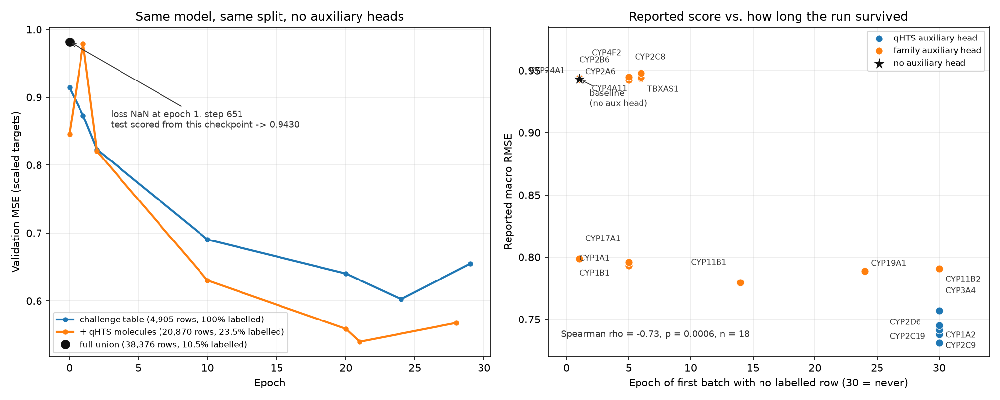

# The Auxiliary-Head Gain Is a NaN Bug, Not Transfer

**The reported baseline (macro RMSE 0.9430) is a model that trained for one
epoch.** Its loss went NaN at epoch 1, step 651; chemprop then scored the test
set with the last checkpoint written before that, which was epoch 0. Every
number in `reports/head_search_analysis.md` is a comparison against that
artefact, and the ~0.22 "gain" that `tasks/MANIFEST.md` pins as the project's
headline improvement measures **which configurations survived training**, not
which auxiliary heads transfer.

Run locally on 2026-09-21, CPU, chemprop 2.3.1, against a rebuilt union
(`data/train.csv` + PubChem AID 1851 + a fresh ChEMBL/BindingDB family pull),
with `add-split-column`'s scaffold split: 3925 train / 490 val / 490 test,
matching the pinned split's shape.

**One caveat on cross-table comparisons.** `assign_splits` groups scaffolds in
row order, so running it on two different tables that hold the same molecules
can put different molecules in test. Numbers below that come from *different*
tables are therefore not measured on identical evaluation rows; the comparisons
that matter (Section 1's full-union pair, Section 7's pair) are run on one
table and are exact.



*Left: three no-auxiliary runs differing only in the training table. Right:
every solo configuration's reported score against the epoch at which replaying
chemprop's sampler first hits a batch with no labelled row. Generated by
`scripts/plot_nan_death_vs_gain.py`.*

## 1. The baseline reproduces, and so does its absence

Same four scored heads, **no auxiliary head in any of these**, seed 0, 30
epochs. The only thing that changes is how many unlabelled rows sit in the
training table:

| Training table | Rows | Labelled rows | Macro RMSE |
|---|---|---|---|
| Full union (challenge + qHTS + family) | 38,376 | 10.5% | **0.9417** (reported: 0.9430 ± 0.0018) |
| **Same table, same split, unlabelled rows dropped** | 4,905 | 100% | **0.7313** |
| Challenge table only (own split) | 4,905 | 100% | 0.7771 ± 0.0015 (3 seeds) |
| Challenge + qHTS molecules (own split) | 20,870 | 23.5% | 0.6935 |

The first two rows are the clean pair: identical molecules, identical
evaluation rows, identical everything except that the second drops rows no
target column labels. **0.9417 -> 0.7313 with no new information whatsoever.**

The bottom two rows use their own split assignments (see the caveat above), so
read them as "a working model of this data scores 0.69-0.78," not as exact
deltas. Either way, a model with no auxiliary information at all beats the
search's best configuration (CYP1A2+CYP2C8, 0.7184).

## 2. The baseline run dies

`trainer_logs/version_0/metrics.csv` for the full-union baseline contains
exactly one finite validation entry:

```
epoch 0, step 584:  val/mse 0.9814
epoch 1:            val/mse nan
```

First NaN training loss logged at step 699. Chemprop keeps training to epoch
29, logs NaN throughout, then evaluates the test set from the best checkpoint —
still epoch 0. The run exits 0 and prints a plausible number.

## 3. Mechanism: 0/0 in the masked loss

`chemprop/nn/metrics.py` reduces the loss as

```python
self.total_loss += (L * weights * self.task_weights * mask).sum()
self.num_samples += mask.sum()
...
return self.total_loss / self.num_samples
```

`num_samples` counts **valid targets in the batch**. A batch in which no row
carries a single non-null target gives 0/0 = NaN, which reaches the gradients
and destroys every weight.

`build-union` keeps auxiliary-only molecules as rows so that selecting an
auxiliary head brings its molecules along. A configuration that selects *few*
auxiliary heads therefore trains on a table that is almost entirely unlabelled:

| Table | Unlabelled | P(64-row batch is empty) | Expected empty batches in 30 epochs |
|---|---|---|---|
| Challenge only | 0% | 0 | 0 |
| Challenge + qHTS | 76.5% | 3.6e-8 | 0.00 |
| Full union, no aux | 89.5% | 8.3e-4 | 14.5 |

## 4. The death is deterministic, and the seed spread is fake

Chemprop shuffles the training data with `--data-seed` (**default 0**), not
with `--pytorch-seed`. `head-search` varies only `--pytorch-seed`, so all three
"seed replicates" of a configuration see the **identical batch partition** and
die at the identical step. That is why the dead configurations report seed
spreads of ±0.0002 to ±0.0017: three copies of the same epoch-0 model.

Replaying that sampler (`scripts/diagnose_null_batches.py`) predicts the first
empty batch for the no-aux baseline at **epoch 1, step 651**. Observed: first
NaN logged at step 699, i.e. it arose in (649, 699]. The prediction is exact.

## 5. Every reported score tracks time-to-NaN

Simulated first-empty-batch epoch per solo configuration, against the macro
RMSE that configuration reported:

| Config | Labelled | Dies at epoch | Reported macro RMSE |
|---|---|---|---|
| CYP3A4 | 70.8% | never | 0.7569 |
| CYP2D6 | 63.5% | never | 0.7416 |
| CYP2C9 | 63.1% | never | 0.7378 |
| CYP1A2 | 60.1% | never | 0.7313 |
| CYP2C19 | 59.5% | never | 0.7450 |
| CYP19A1 | 17.7% | 24 | 0.7889 |
| CYP11B2 | 16.8% | never | 0.7909 |
| CYP11B1 | 15.2% | 14 | 0.7797 |
| CYP17A1 | 13.0% | 1 | 0.7988 |
| CYP1A1 | 12.1% | 5 | 0.7930 |
| CYP1B1 | 12.1% | 5 | 0.7960 |
| CYP2C8 | 12.1% | 5 | 0.9447 |
| TBXAS1 | 12.8% | 6 | 0.9437 |
| CYP4F2 | 11.7% | 6 | 0.9480 |
| CYP4A11 | 11.7% | 6 | 0.9442 |
| CYP2B6 | 11.2% | 5 | 0.9424 |
| CYP2A6 | 11.1% | 1 | 0.9429 |
| CYP24A1 | 10.7% | 1 | 0.9438 |
| baseline | 10.5% | 1 | 0.9430 |

Spearman(death epoch, macro RMSE) = **-0.73, p = 0.0006, n = 18**. The five
qHTS heads label 60-71% of rows, never hit an empty batch, and occupy the top
of the table. Everything at ~11% labelled dies in the first few epochs and
lands at ~0.94. The correlation is not perfect because the family heads here
come from a 2026-09-21 ChEMBL/BindingDB pull whose row counts differ from the
2026-09-14 one, which shifts each head's density slightly.

This also explains what `head_search_analysis.md` called the bimodal split, the
"inert tier", and the finding that row count does not predict gain. Row count
predicts *label density*, which predicts *how long the run survives*. It is not
a statement about chemistry.

## 6. Controls

Every control was run locally on the same split, seed 0, 30 epochs unless
noted.

| Control | Macro RMSE | What happened |
|---|---|---|
| No-aux, challenge table, seeds 0/1/2 | 0.7786 / 0.7770 / 0.7757 (mean 0.7771 ± 0.0015) | trained all 30 epochs |
| No-aux, challenge table, **60 epochs** | 0.7854 | trained; slightly worse |
| No-aux, full union, batch 64 | 0.9417 | **NaN at epoch 1**, scored from epoch 0 |
| No-aux, full union, **batch 256** | 0.8015 | **NaN at epoch 6**, scored from epoch 5 |

Two things follow.

**More epochs is not the fix.** The run dies at epoch 1 no matter how many are
scheduled, and on a healthy table the extra epochs are worth nothing (0.7854 at
60 vs. 0.7771 ± 0.0015 at 30). Note that a healthy table's seed spread,
±0.0015 over three seeds, is about the same as the dead configurations report —
but there it comes from three copies of one dead run, not three samples.

**A bigger batch only buys time, and the sampler predicts exactly how much.**
At batch 256 the simulation puts the first empty batch at epoch 6, batch 146 —
the *trailing partial batch* of 100 rows, since chemprop sets `drop_last` from
`--batch-norm` and therefore keeps it. The run indeed trained through epoch 6
and then went NaN, scoring 0.8015 from its epoch-5 checkpoint. Predicted and
observed death points now agree in two independent runs (batch 64: epoch 1,
step 651; batch 256: epoch 6, batch 146).

That also means a partial final batch is a second, smaller-N exposure: 100 rows
at 10.5% labelled is empty with probability 1.5e-5 per epoch even when the
full-size batches are safe.

## 7. What an auxiliary head is actually worth

Both rows below come from the same table, the same evaluation molecules, seed
0, 30 epochs, with the fix applied so neither run dies:

| Full union, unlabelled rows dropped | Training rows | Macro RMSE |
|---|---|---|
| No auxiliary head | 4,905 | 0.7313 |
| **+ CYP1A2 auxiliary head** (the search's round-1 pick) | 23,454 | **0.6946** |

**0.037**, against the 0.212 the same head reported. Roughly one sixth, and one
seed — the three-seed treatment is still owed, though the seed spread on a
healthy run is ~0.0015, so the sign is not in doubt.

Even that 0.037 is not purely transfer. The auxiliary head brings 18,549 extra
molecules into training, which at batch 64 is 366 optimizer steps per epoch
instead of 77. Separating "more gradient steps" from "auxiliary chemistry"
needs a control that holds the row count fixed — a shuffled-label copy of the
same auxiliary block is the obvious one, and has not been run.

## 8. What this invalidates

- **The 0.2247 headline improvement** (`tasks/MANIFEST.md`) — it is the gap
  between an epoch-0 model and a trained one.
- **`reports/head_search_analysis.md`** in full: the volume-vs-gain analysis,
  the qHTS-redundancy story, the "CYP3A4-aux is self-contained" reading, and
  the greedy search's pick of CYP1A2+CYP2C8.
- **`reports/protein_similarity_analysis.md`** — the conclusion (enzyme
  similarity does not predict gain) stands, but only because the quantity it
  regresses against was noise. It should be re-run once the gains are real.
- **`reports/data_volume_vs_gain.png`** and the T8 chemical-space gain
  colourings, which paint datasets by the same broken numbers.

What it does **not** invalidate: the union construction, the split, the
InChIKey keying, or the idea that auxiliary heads help. Section 7 measures one
head properly and finds +0.037 rather than +0.212 — real, small, and still
confounded with the extra optimizer steps its molecules buy.

## 9. The fix

`_run_once` in `src/models/head_search.py` now drops rows carrying no value in
any selected target column before training. Those rows cannot produce a
gradient, so nothing is lost, and the empty-batch probability goes to zero by
construction. It also makes configurations honest: each one trains on exactly
the molecules its heads label.

More epochs is **not** a fix — the run dies at epoch 1 regardless of how many
are scheduled (Section 6). Raising `--batch-size` only delays the death, and
leaves the trailing partial batch exposed.

Before re-running the search, check any table with:

```bash
python scripts/diagnose_null_batches.py --data-path data/union_train.csv
```

and set `--data-seed` per replicate alongside `--pytorch-seed`, so that three
seeds are three samples rather than one sample three times.

## 10. Reproducing this

```bash
build-pubchem-aux
build-family-datasets && build-family-heads
build-union --auxiliary pubchem=data/pubchem_aid1851.csv family=data/family_heads.csv
add-split-column
python scripts/diagnose_null_batches.py --data-path data/union_train.csv   # predicts the death step
chemprop train --data-path data/union_train.csv --smiles-columns SMILES \
  --target-columns CYP1A2_pIC50_direct_inhibition CYP2C9_pIC50_direct_inhibition \
                   CYP2D6_pIC50_direct_inhibition CYP3A4_pIC50_direct_inhibition \
  --task-type regression --epochs 30 --pytorch-seed 0 --splits-column split \
  --show-individual-scores --output-dir /tmp/baseline
grep val_loss /tmp/baseline/model_0/trainer_logs/version_0/metrics.csv | head
```
