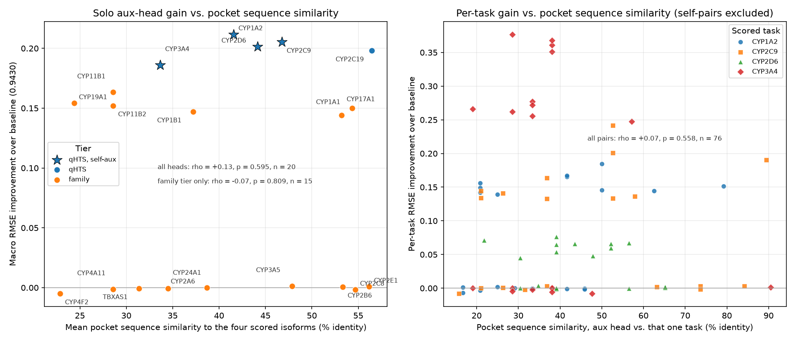
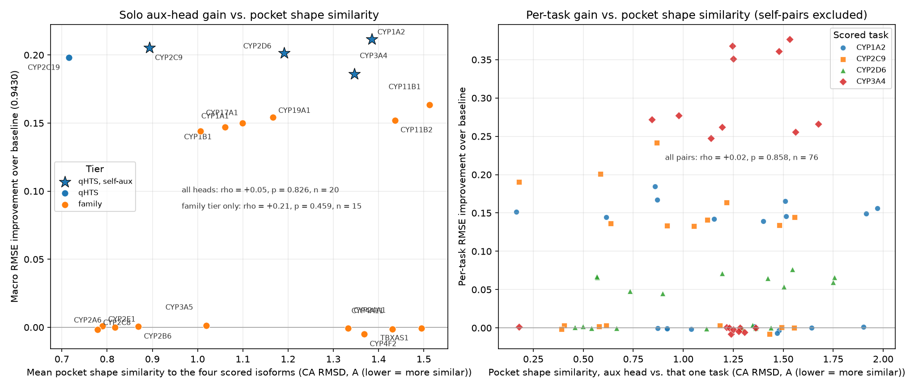
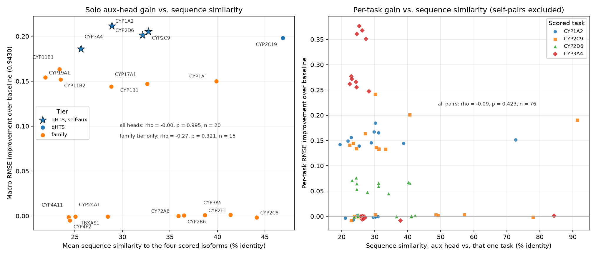
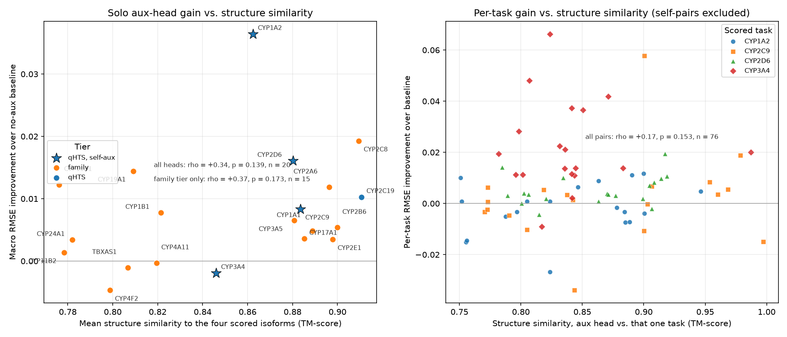

# Does Enzyme Similarity Explain Auxiliary-Head Gain?

`reports/head_search_analysis.md` Section 4 left the bimodal split unexplained:
a solo aux head either buys ~0.15-0.21 macro RMSE or buys nothing, and row
count does not predict which. One candidate explanation is protein
relatedness — an aux isoform that is *like* the scored enzymes should transfer,
one that is not should not. This report tests that directly.

Source: `scripts/protein_similarity.py` (run 2026-09-21, local: ~50 s with the
UniProt/AlphaFold/RCSB cache warm, ~2 min cold). Sequences from UniProt
(reviewed human entries), models from AlphaFold DB v6, heme donors from RCSB.
Gains are the solo-head rows of `results/head_search_results.csv` (baseline
0.9430 ± 0.0018). Per-gene table: `results/protein_similarity.csv`.

## TL;DR

**No.** Nothing about the enzyme predicts gain — not whole-protein sequence
identity, not fold similarity, and not the active site, which is the version of
the question that actually had a mechanism behind it.

Spearman rho of solo-head macro gain against each similarity axis
(mean over the four scored isoforms, self-pairs excluded):

| Slice | Sequence identity | TM-score | **Pocket identity** | **Pocket CA RMSD** |
|---|---|---|---|---|
| All 20 aux heads | -0.00 (p = 0.995) | +0.03 (p = 0.885) | **+0.13 (p = 0.595)** | **+0.05 (p = 0.826)** |
| Family tier only (n = 15) | -0.27 (p = 0.321) | -0.24 (p = 0.383) | **-0.07 (p = 0.809)** | **+0.21 (p = 0.459)** |
| Every (aux head, scored task) pair (n = 76) | -0.09 (p = 0.423) | +0.01 (p = 0.941) | **+0.07 (p = 0.558)** | **+0.02 (p = 0.858)** |

Flat on all four axes, at every slice. Where a trend shows at all it points the
**wrong way**: inside the family tier the inert heads are the *more* similar
ones on whole-protein identity (median max 48.6% vs. 30.4% for the gainers,
Mann-Whitney p = 0.15) and on pocket identity (median max 63.2% vs. 48.5%,
p = 0.37).

## The pocket axes, and why they are the ones that matter

Whole-chain TM-score is the weakest of the four tests by construction: every
P450 shares the triangular-prism fold, so the observed range is 0.75-1.00 and
almost all of it is the fold, not the chemistry. Whole-protein identity has the
same problem in milder form — it is dominated by the conserved core, the
I-helix and the cysteine ligand loop. What decides whether two P450s turn over
the same molecules is the ~20 residues lining the cavity above the heme.

So the pocket is measured directly:

1. A ligand-bound crystal structure of each scored isoform (CYP1A2 2HI4,
   CYP2C9 1R9O, CYP2D6 4WNV, CYP3A4 1TQN) is superposed on that isoform's
   AlphaFold model and its heme carried into the model frame. Fit RMSDs:
   0.39, 2.11, 0.63, 1.52 A.
2. Pocket = every residue with a heavy atom within 6 A of the heme **on the
   distal side** of the porphyrin plane (plane from the four pyrrole
   nitrogens, oriented away from the axial cysteine). The distal filter is the
   point: the proximal shell is the Cys ligand loop, invariant across the whole
   superfamily, and including it would flatten the axis by construction.
3. Residue correspondence comes from the TM-align structural alignment, not a
   sequence alignment — at 20-30% global identity a sequence alignment of the
   cavity is not trustworthy. Coverage is >= 92% of pocket positions for every
   pair.

The definition recovers the textbook active sites: CYP3A4 gives R105, S119,
I120, F302, A305, T309, I369, A370, R372, L373, E374; CYP2C9 gives R97, F114,
T301/T302, L362, S365, L366. Pocket sizes are 19-24 residues.

This axis has the dynamic range the global ones lack — pocket identity spans
16-89% across non-self pairs, versus 19.5-91.4% for whole-protein identity but
with the conserved bulk stripped out. It is still flat against gain, and the
result holds at an 8 A cutoff (36-39 residue pockets: rho = -0.01 over all 20,
-0.27 family-only), so it is not an artefact of where the boundary was drawn.

## Method

- **Sequence.** Global Needleman-Wunsch (BLOSUM62, -11/-1, end gaps free)
  between canonical UniProt sequences; percent identity over the shorter
  sequence. End gaps are unpenalised because several P450s differ mainly by a
  longer N-terminal membrane anchor, which is not a specificity difference.
- **Structure.** TM-align over AlphaFold CA traces, reported as the mean of the
  two length normalisations. P450 lengths differ by at most ~15%, so the two
  normalisations are close and the mean is symmetric.
- **Pocket sequence.** Percent identity over the scored isoform's pocket
  positions, read off the TM-align correspondence (see the section above).
- **Pocket shape.** CA RMSD over those same matched positions after a Kabsch
  fit on the pocket pairs alone, so it is cavity geometry rather than whether
  the two folds superpose — they always do. Lower is more similar.
- Each aux head is measured against all four scored isoforms, then summarised
  as the mean (the metric is a macro average over those same four tasks) and
  the max (a head could help by resembling just one). Self-pairs are dropped
  from the summary: CYP1A2-aux is 100% identical to the CYP1A2 task by
  construction. Those four self-aux heads are drawn as stars and are confounded
  anyway — they carry a supervision channel no external head has.

Observed ranges over non-self pairs: identity 19.5-91.4%, TM-score 0.75-1.00,
pocket identity 16-89%, pocket RMSD 0.17-2.0 A. The whole-chain structural axis
is nearly saturated, as expected inside one fold family, so a flat trend there
carries less weight than the flat trends on the other three.

## The counterexamples are the whole story

| Gene | Max identity to a scored isoform | Max TM | Max pocket identity | Best pocket RMSD | Solo gain |
|---|---|---|---|---|---|
| CYP3A5 | 84.3% (CYP3A4) | 0.987 | 90.5% (CYP3A4) | 0.18 A | **+0.001** (inert) |
| CYP2E1 | 57.1% | 0.969 | 84.2% | 0.41 A | +0.001 (inert) |
| CYP2C8 | 78.0% (CYP2C9) | 0.978 | 73.7% (CYP2C9) | 0.39 A | **-0.002** (inert) |
| CYP2B6 | 48.6% | 0.960 | 73.7% | 0.46 A | +0.001 (inert) |
| CYP1A1 | 72.7% (CYP1A2) | 0.946 | 79.2% (CYP1A2) | 0.17 A | +0.150 |
| CYP11B1 | 24.4% | 0.798 | 39.1% | 0.98 A | **+0.163** (best family head) |
| CYP19A1 | 23.1% | 0.819 | 28.6% | 1.12 A | +0.154 |

CYP3A5 shares 90% of CYP3A4's active-site residues and superposes on that
cavity to 0.18 A, and does nothing. CYP11B1 is a
mitochondrial steroid 11-beta-hydroxylase sharing under a quarter of its
sequence with anything scored, and it is the strongest family head in the
search. CYP1A1 shows the hypothesis is not merely inverted — a highly similar
head *can* gain — the axis just does not separate the two groups.

Volume does not rescue the split either: the six family gainers all have
≥ 856 rows, but so do inert TBXAS1 (1628), CYP2C8 (888), CYP4A11 (872) and
CYP4F2 (872).

## Why this is the expected answer, in hindsight

The model has no protein channel. A shared D-MPNN encoder sees SMILES and
nothing else; each head is a readout on top of it, and the protein identity of
a head is just a column name. Enzyme similarity could therefore only act
*indirectly* — similar enzymes get assayed against similar compound libraries,
so a related isoform's molecules would regularise the encoder in a useful
direction. What the data says is that this indirect path is swamped by which
library a head's rows actually came from: CYP2C8 and CYP3A5 are family heads
built from small BindingDB/ChEMBL med-chem series, while CYP11B1 and CYP19A1
are family heads built from different, larger series. Provenance of the ligand
set dominates homology of the protein.

This strengthens rather than weakens the chemical-space hypothesis in
`head_search_analysis.md` Section 4 and the maps in `scripts/chemspace.py`:
having ruled out row count, nearest-neighbour Tanimoto to the eval set, and now
protein relatedness on four axes including the active site itself, the
remaining explanations are
properties of each head's molecule *distribution* (coverage, diversity,
label consistency), not of its enzyme.

## Caveats

- n = 20 heads (15 external), one split, solo configs only. Underpowered for
  anything but a strong effect; a strong effect is what the hypothesis
  predicted and it is absent.
- Gains below ~0.004 are seed noise, which is the entire inert group — they are
  "no effect", not small effects to be ranked among themselves.
- Pockets are defined on AlphaFold apo models with a heme borrowed from a
  crystal structure, and P450 cavities are famously plastic — CYP3A4's expands
  by hundreds of cubic angstroms on binding. A static first-shell definition
  cannot see that. The T5 co-folded complexes would allow a ligand-aware
  version (cavity volume, per-ligand contact fingerprints) rather than a
  residue list, and only that would fully close the question.
- The 1R9O -> AlphaFold fit for CYP2C9 is 2.11 A, noticeably worse than the
  other three (0.39-1.52 A); the heme placement is still consistent with the
  known 2C9 active site, but this pocket is the least precisely located of the
  four.
